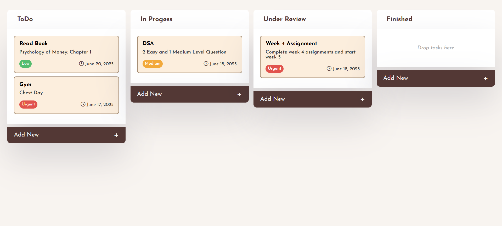

# 📝 Taskify

Taskify is a dynamic task management web app built with HTML, CSS, and JavaScript. It allows users to create, organize, and drag & drop tasks between different status categories like **ToDo**, **In Progress**, **Under Review**, and **Finished**. 

---

## ✨ Features

- 🧠 Add new tasks via a popup form
- 🗃️ Organize tasks into four categories
- 📦 Drag and drop tasks between columns
- 🎯 Priority tags with colored indicators
- 📅 Deadline input with formatted display (`June 20, 2025`)
- 🪄 Responsive and interactive UI
- ✅ Empty state indication

---

## 🛠️ Tech Stack

- **HTML5** – Structure
- **CSS3** – Styling and layout
- **JavaScript (ES6)** – DOM manipulation and event handling
- **Font Awesome** – For icons

---

## 📁 Project Structure

```bash
taskify/
│
├── index.html # Main HTML structure
├── style.css # Styling and responsiveness
├── index.js # Core JavaScript logic
└── README.md 
```


## 🛠️ Technologies Used

- HTML5
- CSS3
- JavaScript (ES6)

## 🔮 Upcoming Features

- [ ] Store tasks in a JSON file (simulate local data).
- [ ] Save and load tasks using `localStorage`.
- [ ] Connect to a backend database (e.g., Firebase, MongoDB).
- [ ] Add user authentication and login system.
- [ ] Edit and delete tasks.

## 📸 Preview




## 🤝 Contributing

Pull requests are welcome. For major changes, please open an issue first.

## 📄 License

[MIT](LICENSE)
