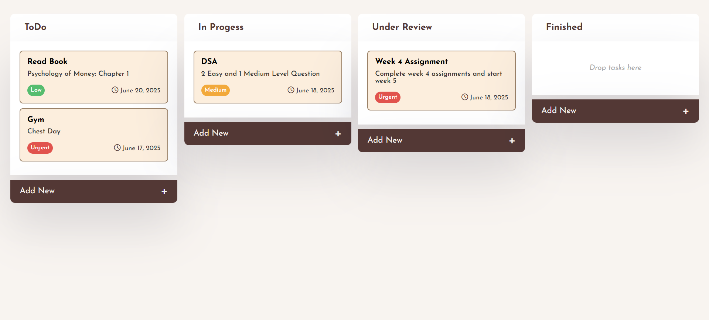

# 📝 Taskify Frontend

Taskify is a modern, full-stack task management web application. This repository contains the **frontend** client, built with HTML, CSS, and JavaScript, which interacts with a secure backend API to provide a seamless, authenticated task management experience.

---

## ✨ Features

- 🔒 **User Authentication:** Sign up, log in, and log out securely.  
- 🧠 **Add, Edit, and Delete Tasks:** Create new tasks, modify existing ones, or remove them.
- 🗃️ **Organize Tasks by Status:** Move tasks between **ToDo**, **In Progress**, **Under Review**, and **Finished** columns.
- 📦 **Drag & Drop:** Reorder and update task status intuitively with drag-and-drop.
- 🎯 **Priority & Deadline:** Assign priorities (Low, Medium, Urgent) and set deadlines for tasks.
- 📅 **Persistent Storage:** All tasks are saved and loaded via a backend API—never lose your data.
- 🪄 **Responsive, Modern UI:** Clean, mobile-friendly interface with interactive feedback.
- ✅ **Empty State Indication:** Visual cues when columns have no tasks.
- 🚪 **Logout:** End sessions securely from any device.

---

## 🛠️ Tech Stack

- **HTML5** – Structure
- **CSS3** – Styling and layout
- **JavaScript (ES6)** – Logic and API interaction
- **Font Awesome** – Icons

---

## 📁 Project Structure

```bash
taskify-frontend/
│
├── index.html # Main app UI
├── style.css # Styling and responsive design
├── js/
│ ├── index.js # Core JS logic and API calls
│ └── auth.js # Authentication logic (login/signup)
├── login.html # Login page
├── signup.html # Signup page
├── assets/ # Images, icons, etc.
└── README.md
```

## 🔗 Backend

This frontend requires the [Taskify Backend](https://github.com/jaiswalism/taskify-backend) to be running.  
All user authentication and task data are managed via the backend API.

## 🚧 Upcoming Features

- **Due Date Reminders:** Implement basic reminders or visual indicators for upcoming or overdue tasks within the app.
- **Dark Mode:** Provide an optional dark theme toggle for better accessibility and user preference.
- **Accessibility Improvements:** Improve keyboard navigation and ensure screen reader compatibility.

## 📸 Preview




## 🤝 Contributing

Pull requests are welcome. For major changes, please open an issue first.

